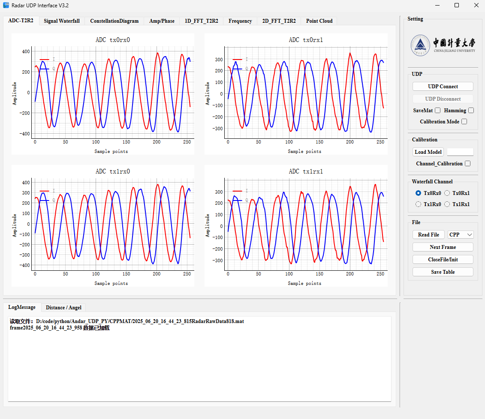
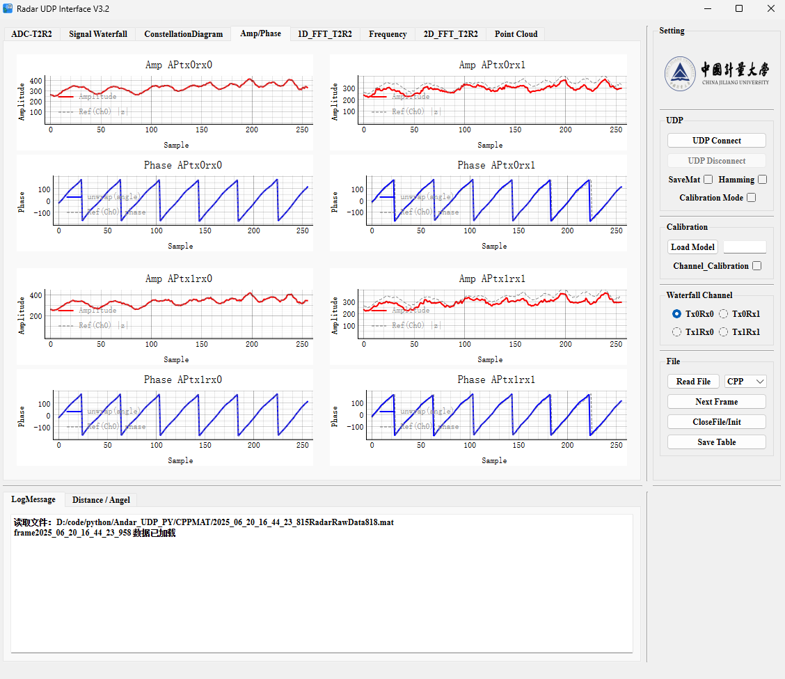
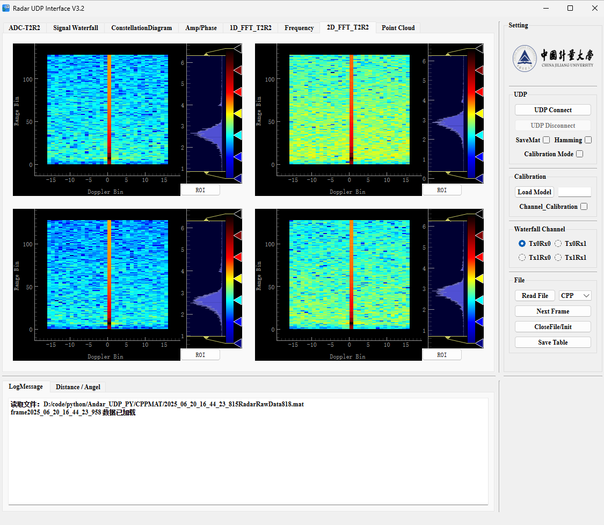
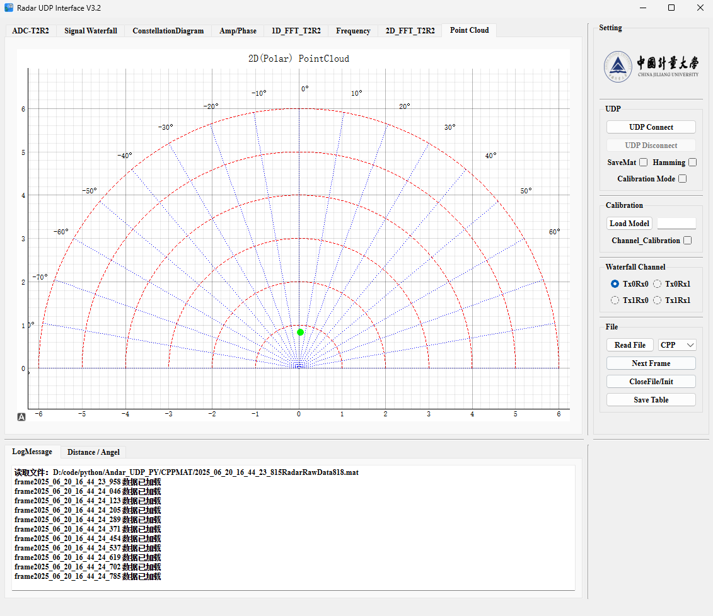

# Project Name: FMCW Radar GUI

## Introduction

This project is a Python-based desktop application for real-time acquisition (data transmission via UDP), processing, and visualization of radar data. It uses `PyQt` to build the user interface and `PyQtGraph` for efficient graphical display. Main features include:

- Real-time display of raw ADC data from four virtual antennas.
- Real-time display of constellation diagrams for four virtual antennas.
- Real-time display of amplitude and phase fluctuation diagrams for four virtual antennas.
- Real-time calculation and display of 1D FFT results.
- Real-time calculation and display of 2D FFT (range-Doppler) results.
- Real-time calculation and display of 2D point clouds.
- Support for saving real-time data to `.mat` files.

This program is specially optimized for radar signal processing. With the high-performance drawing capability of `PyQtGraph`, it ensures smooth GUI experience even when handling high frame rate data.

## Project Structure

Core files of the project may include:

- `Andar_udp.py`: Main program file, containing GUI and data processing logic.
- `Radar_UDP.ui`: UI file designed with Qt Designer.
- `data_processing.py`: Mainly contains radar IQ data reorganization, 1D FFT, 2D FFT, etc.
- `display_pg.py`: Mainly for GUI binding, initialization, and display calls.
- `udp_handler.py`: UDP signal transmission and related work.
- `raw_data.mat`: Radar raw data file saved by the program.

## How to Run

### 1. Dependencies

Before running the project, please make sure you have installed all necessary Python libraries. You can use `pip` to install them:

```bash
pip install PyQt5 pyqtgraph numpy scipy
```

- **`PyQt5`**: For building the graphical user interface.
- **`pyqtgraph`**: For high-performance scientific plotting.
- **`numpy`**: For numerical array processing.
- **`scipy`**: For loading and saving `.mat` files.

### 2. Run the Program

After installing the dependencies, simply run the main program file:

```
python Andar_udp.py
```

### 3. Data Saving

The program supports saving real-time data to `.mat` files. Each time the program starts, it automatically generates a `.mat` file named with the current timestamp, such as `2025_08_20_14_30_00_raw_data_py.mat`, and all processed frame data will be appended to this file.

## Main Features

### Transmission Protocol: UDP

Packet length: 1024 bytes

Data type: Big-endian

First Frame (1024 bytes):

|    4 bytes    |    4 bytes    |    4 bytes    |    4 bytes    |    4 bytes    |    4 bytes    |

FirstNumber     SecondNumber         FrameID            ChirpNum     Sample_POINT      TXRXTYPE

The rest are padded with zeros (1000 bytes)

FirstNumber : 0x11223344

SecondNumber : 0x44332211

FrameID : Increments by one after sending all ADC sampled data once (max 0xFFFFFFFF)

ChirpNum : Configuration from the lower computer (e.g., 64)

Sample_POINT : Configuration from the lower computer (e.g., 128)

TXRXTYPE : Configuration from the lower computer (e.g., 1)

Only three modes: TX1RX1 (1), TX1RX2 (2), TX2RX2 (4)

Other Frame (1024 bytes): Pure ADC data

### Initialize Interface


------

### Real-time ADC Data (tab page: ADC-T2R2)

Displays **time-domain waveforms of raw I/Q channels**.
Each channel plots I (red) and Q (blue) separately for real-time observation of signal quality, DC offset, and noise level.

**Main Features:**

- **Four-channel independent display**
   Corresponds to four virtual antennas (TX0RX0, TX0RX1, TX1RX0, TX1RX1), each with its own waveform plot.
- **I/Q separated plotting**
   I and Q are displayed with red and blue curves, respectively, for easy comparison of amplitude and phase.
- **Auto-scaling**
   X-axis automatically locks to the sample point range, Y-axis adapts to amplitude changes.
- **Real-time refresh**
   Updates once per frame, only shows the latest data, no overlay of historical waveforms.

**Use Cases:**

- Check if the received signal is saturated or too weak.
- Determine if there is DC offset in the hardware link.
- Observe noise level and signal stability.

### Real-time ADC Interface



------

### **Amp/Phase Timing Diagram (tab page: Amp/Phase)**

This feature shows the **amplitude** and **phase** changes for each virtual antenna, providing intuitive time-domain signal analysis to help observe signal stability. This is especially important for verifying calibration effects during **amplitude and phase calibration**.

#### **Main Features:**

- **Multi-channel support:**
   Supports 4 virtual antennas (TX0RX0, TX0RX1, TX1RX0, TX1RX1), each with independent amplitude and phase timing diagrams. Users can observe amplitude/phase changes of multiple channels simultaneously.
- **Amplitude diagram:**
   Plots amplitude changes over time, showing signal **strength** (or energy). Useful for observing amplitude fluctuations.
- **Phase diagram:**
   Plots phase changes over time, usually to observe **phase stability**. Ideally, phase should change linearly; jumps may indicate phase jitter or frequency offset.
- **DC removal:**
   Provides an option to **remove DC component**, making amplitude and phase diagrams smoother. This ensures the signal's zero point is correct, especially during calibration.
- **Real-time update:**
   Updates amplitude and phase diagrams with each new data frame, ensuring the latest signal status is displayed. Each **frame** (default shows chirp 0) has an independent timing diagram update.
- **Auto-scaling:**
   Automatically adjusts coordinate ranges based on amplitude and phase data, ensuring the graph is always centered. Y-axis range adapts to actual data to avoid incomplete display.
- **Amplitude/phase comparison:**
   Uses channel 0 (tx0rx0) as a reference, compares amplitude and phase of the other three channels with channel 0, and calculates robust median differences to obtain ΔAmp and ΔPhase.

#### **Use Cases:**

- **Signal quality analysis:**
   Observe amplitude diagram for signal strength stability and amplitude unevenness, especially during signal attenuation or saturation.
   Observe phase diagram for linearity and phase jitter or frequency offset.
- **Amplitude/phase consistency check:**
   During **amplitude/phase calibration**, amplitude and phase timing diagrams help judge if I/Q channel amplitude and phase are consistent.
   Phase diagrams help check for phase bias between antennas and whether calibration is needed.
- **Real-time monitoring:**
   For **real-time signal monitoring**, especially in radar signal acquisition or wireless communication testing, users can dynamically observe signal changes and adjust parameters in time.

#### **Feature Overview:**

- **Amplitude diagram** shows the **amplitude** of I/Q signals over time.
- **Phase diagram** shows the **phase** of I/Q signals over time, usually for analyzing phase linearity and frequency offset.
- Provides **DC removal** option to ensure signal stability.
- Real-time data update and auto-scaling.
- Each virtual antenna has independent amplitude/phase timing diagrams for signal quality analysis.

### Amp/Phase Interface



------

### Constellation Diagram Display (tab page: Constellation Diagram)

The software now supports **real-time constellation diagram display** for visualizing the I/Q distribution of each antenna channel.

**Main Features:**

- **Multi-channel support**
  Four virtual antennas (TX0RX0, TX0RX1, TX1RX0, TX1RX1), each with an independent constellation diagram window.
- **Real-time refresh**
  Each frame automatically updates, using overwrite mode (no overlay of historical points).
- **DC removal**
  Removes DC offset by default to avoid constellation center drift.
- **Reference circle display**
  Draws a reference circle based on RMS radius to help judge amplitude consistency.
- **Auto-scaling**
  Automatically adjusts coordinate range, with internal protection against NaN/Inf to avoid overflow warnings.
- **Efficient plotting**
  Automatically samples when there are too many points (`max_points=4000`) to ensure smooth plotting.

**Ellipse Fitting:**

Based on the constellation diagram, **ellipse fitting** is added for quantitative analysis of I/Q signal **amplitude consistency** and **phase orthogonality**.

#### **Fitting Metrics:**

- **Axis ratio (b/a)**
  - Definition: Ellipse minor axis / major axis.
  - Meaning: Measures I/Q amplitude consistency.
    - Close to 1.0 → Distribution is nearly circular, good amplitude match.
    - Smaller → More elliptical, indicating amplitude mismatch or high channel correlation.
- **Tilt**
  - Definition: Rotation angle of the ellipse's major axis relative to the I axis.
  - Meaning: Measures I/Q orthogonality.
    - Ideally should be close to 0°.
    - If tilt ≠ 0°, indicates phase error.
  - Note: When the distribution is nearly circular (axis_ratio ≈ 1), tilt direction may be unstable, with ±90° jumps. The code normalizes tilt to the [-45°, +45°] range for intuitive display.

#### **Graphical Elements:**

- **Blue scatter**: Actual I/Q distribution.
- **Red dashed circle**: RMS reference circle.
- **Green ellipse**: PCA fitting result.
- **Green line segments**: Major and minor axis directions.
- **Text in upper right**: Displays `axis_ratio` and `tilt` values.

**Use Cases:**

- Debugging I/Q channel orthogonality.
- Observing the distribution of received signals (ideally a circle or cluster).
- Combined with ADC/FFT for quick hardware link troubleshooting.

### Constellation Diagram Interface


------

### 1D FFT (Range Spectrum) (tab page: 1D-FFT-T2R2)

Performs **fast Fourier transform (FFT)** on the ADC time-domain signal of each antenna, showing the energy distribution in the range dimension.

**Main Features:**

- **Four-channel support**
   Each antenna independently displays the amplitude spectrum of 1D FFT.
- **Amplitude spectrum display**
   Y-axis is amplitude, X-axis is FFT bin (corresponding to range).
- **Auto-cropping of valid range**
   Only displays half the spectrum (0 ~ N/2 bin) to avoid spectrum mirroring.
- **Real-time refresh**
   Updates automatically per frame, showing the latest range information.

**Use Cases:**

- Obtain target range information (peak position = target range).
- Compare echo strength of different antennas.
- Assist in debugging antenna channel consistency.

### 1D FFT (Range Spectrum)  Interface


------

### 2D FFT (Range-Doppler Spectrum) (tab page: 2D-FFT-T2R2)

Based on 1D FFT, performs another FFT on the chirp dimension to generate a **range-velocity 2D spectrum** (also called Range-Doppler Map).

**Main Features:**

- **2D heatmap display**
   X-axis = Doppler frequency (velocity), Y-axis = range bin.
- **Logarithmic display**
   Shows `log10(|signal|)` for easier observation of weak targets.
- **Zero velocity centered**
   Doppler zero is FFT shifted to the center, stationary targets are in the middle.
- **Four-channel independent display**
   Each antenna displays its own Range-Doppler heatmap.

**Use Cases:**

- Analyze target **range** and **velocity** simultaneously.
- Distinguish stationary objects (Doppler zero) and moving targets (left/right).
- Observe multipath effects or interference.

### 2D FFT (Range-Doppler Spectrum) Interface



------

### 2D Point Cloud Display (tab page: Point Cloud)

Based on FFT-extracted **target range + angle** information, plots target points in a polar semicircle.

**Main Features:**

- **Polar coordinate plotting**
   Semicircle faces up, X-axis = left/right azimuth, Y-axis = range.
- **Buffer mechanism (deque)**
   Only one point is plotted per frame, keeps the latest 5 frames, FIFO, smoothing the target trajectory.
- **Adaptive range**
   Radius range is controlled by the set maximum range `r_max`, angle range by the field of view (FOV).

**Use Cases:**

- Intuitively display target distribution in 2D (range-angle).
- Observe target trajectory and angle changes.
- Combined with range/Doppler spectrum for more intuitive spatial information.

### 2D Point Cloud Interface



------

### IQ Calibration (Amplitude and Phase)

Compensates the **original IQ data** received by each antenna to eliminate channel inconsistencies caused by hardware differences, obtaining true and accurate target parameters.

**Main Features:**

- **Hardware difference compensation** Eliminates inherent amplitude and phase imbalance among antennas, ensuring consistent response for all virtual channels.
- **Least squares based** Uses iterative least squares (for amplitude) and linear least squares (for phase) to robustly solve calibration factors.
- **One-time calibration** Only needs to be performed once in a specific environment (facing a point target), and the calibration matrix can be saved and applied to all subsequent data.
- **Seamless integration** By loading the calibration matrix, all original IQ data can be automatically corrected at an **early stage** (before FFT) in data processing.

**Use Cases:**

- **Improve angle estimation accuracy** After calibration, phase differences only reflect target direction, significantly improving the accuracy of DBF or MUSIC angle algorithms.
- **Ensure target intensity consistency** Calibrated amplitude spectrum truly reflects target echo strength, enabling reliable comparison among channels.
- **Radar system debugging** Used to evaluate and verify channel consistency of antenna arrays, a key step in system integration and verification.

## Contribution

If you find any issues or have suggestions for improvement, feel free to submit an Issue or Pull Request.
